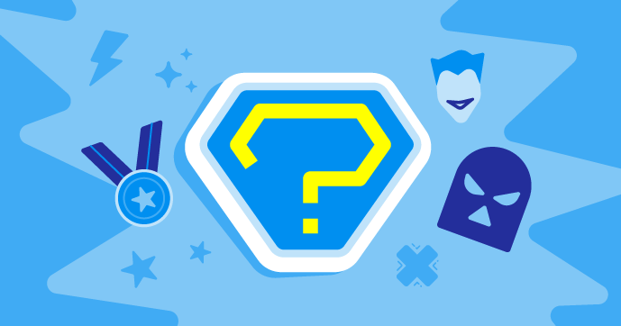

## Introduction
Welcome to Stage 2 of the Experience AI Challenge! You're about to embark on an epic journey where we cross the realms of literature, machine learning, and coding.

Ever notice how those heroes and villains in your favorite stories have distinctive ways of expressing themselves? What if we could teach a machine to identify those patterns, to tell if a quote is more likely to come from a goodie or a baddie? Well, gear up because that's exactly the adventure we're setting out on! Don't worry, we're not just tossing you into this epic battle of good and evil alone - we'll guide you through every twist and turn as you develop your **text classification application**. 

So, ready to get your superhero (or villain) game on? Let's unmask this project and unravel the power of AI together!

### You will

Using the Machine Learning for Kids platform, a pinch of Scratch, and a whole lot of literary quotes, you will:
  + build a machine learning model on Machine Learning for Kids
  + Collect text data from famous literary heroes and villains
  + Train your machine learning model on your collected quotes
  + build a text classifier that can tell heroes and villains apart by what they say. 
