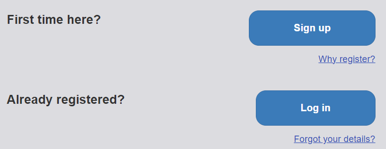
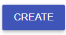
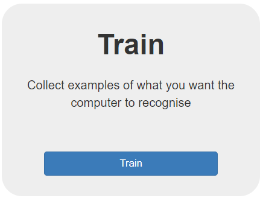

## Create your machine learning model

First, create your machine learning model on Machine Learning for Kids:

--- task ---

Open the website [Machine Learning for Kids](https://machinelearningforkids.co.uk/#!/login){:target="_blank"}.

--- /task ---

--- task ---

In the screen that appears, choose **Log In** if your mentor gave you some login details. Enter your username and password on the next screen.

Choose **Sign Up** if you are creating your own account and follow the prompts to create a new account.

--- /task ---

--- task ---

Select **Go to your Projects**.

--- /task ---

--- task ---

Select **Add a new project**.

--- /task ---

--- task ---

Give the project a name and set it to recognise **text**.

--- /task ---

--- task ---

Select **CREATE**. Once created, click on the project title.

--- /task ---

Now that you have created a project that identifies text, you need to set out the different ways your text can be classified or : these will be our **classes**.

--- task ---

Select **Train**. This will let your add new training data to your model.

--- /task ---
