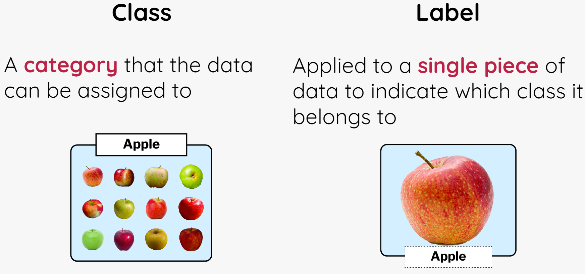

## Create your machine learning model

First, create your machine learning model on Machine Learning for Kids:

--- task ---

Open the website [Machine Learning for Kids](https://machinelearningforkids.co.uk/#!/login){:target="_blank"}.

--- /task ---

--- task ---

In the screen that appears, choose **Log In** if your mentor gave you some login details. Enter your username and password on the next screen.

Choose **Sign Up** if you are creating your own account and follow the prompts to create a new account.

--- /task ---

--- task ---

Select **Go to your Projects**.

--- /task ---

--- task ---

Select **Add a new project**.

--- /task ---

--- task ---

Give the project a name and set it to recognise **text**.

--- /task ---

--- task ---

Select **CREATE**. Once created, click on the project title.

--- /task ---

Now that you have created a project that identifies text, you need to set out the different ways your text can be classified - these will be our **classes**.

--- collapse ---
---
title: Classes and Labels
---

**Labels** are the specific tags we attach to pieces of text so the model can identify what it's reading, while **classes** are the main categories we want to sort these texts into. For this project, we have two classes: 'hero' and 'villain'.

Let's say you're reading a description of a character. If the character does brave and noble things, you might label that description as 'hero'. By doing this, you're telling the model that this text describes a 'hero'. On the other hand, if the character is shown doing sneaky or mean actions, you'd label it 'villain', placing it in the 'villain' class. The model then uses these labels to distinguish between descriptions of heroes and villains.

The classes you pick should guide the model in its decision-making. In this case, it's simple: every description is either about a 'hero' or a 'villain'. But remember, in other projects, you might have multiple classes based on different attributes of the texts you're analyzing.

--- /collapse ---

--- task ---

Select **Train**. This will let your add new training data to your model.

--- /task ---
