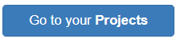

## Create your machine learning model

First, create your machine learning model on Machine Learning for Kids:

--- task ---

Open the website [Machine Learning for Kids](https://machinelearningforkids.co.uk/#!/login){:target="_blank"}.

--- /task ---

--- task ---

On the screen that appears, choose **Log in** if your mentor gave you some login details. Enter your username and password on the next screen.

Choose **Sign up** if you are creating your own account and then follow the prompts to create a new account.

--- /task ---

--- task ---

Select **Go to your projects**.

--- /task ---

--- task ---

Select **Add a new project**.

--- /task ---

--- task ---

Give the project a name and set it to recognise **text**.

--- /task ---

--- task ---

Select **CREATE**. Once created, click on the project title.

--- /task ---

Now that you have created a project that identifies text, you need to set out the different ways your text can be classified — these will be your **classes**.

--- collapse ---
---
title: Classes and labels
---

**Classes** are the major categories you will sort your quotes into. In this case, you only need two **classes**: 'hero' and 'villain'.

**Labels** are the specific names we give to each quote in the training data to help the model identify what is in each quote.

For instance, if you see a quote from a hero in the training data, you'll label that quote as `hero`. By doing this, you're telling the model that this quote belongs to the `hero` class. Similarly, if you have a quote from a villain, you'll label it `villain`, placing it in the `villain` class. Once you train the model on this information, it can be used to predict which class new quotes belong to.

You can use as many classes as you want in your model. In this scenario, it's pretty straightforward: every quote is either from a `hero` or `villain`. But in other projects, you could have multiple classes based on various characteristics of the data you're working with; for example, specific words, a cheerful tone, or the language of a piece of writing.

--- /collapse ---

--- task ---

Select **Train**. This will let your add new training data to your model.

--- /task ---
