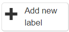
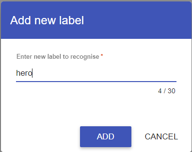
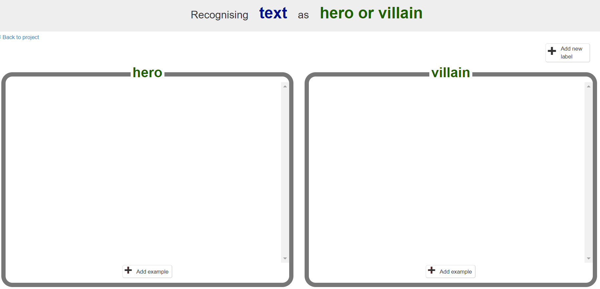
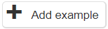
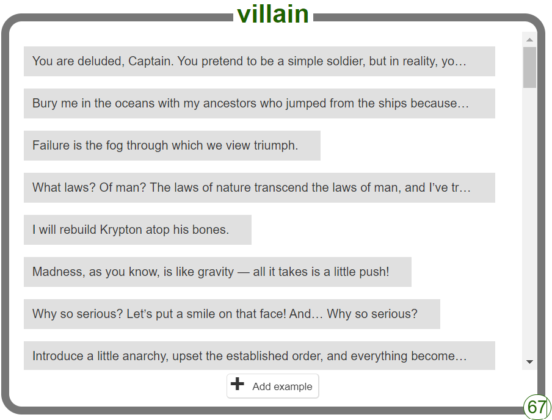
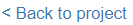
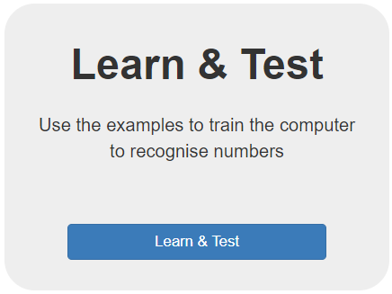
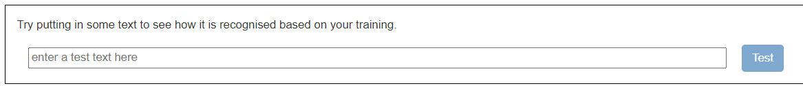

## Train the model

Imagine having a treasure chest full of fun quotes from your favorite movie characters, both the good guys (heroes) and the not-so-good guys (villains), with the quotes in two big piles - one for the heroes and one for the villains. In the world of machine learning, these piles are called "classes". The `hero` class is filled with all the cool things the heroes say, and the `villain` class has all the catchy phrases from the villains. On the back of each quote is a `label` that says whether the quote is a `hero` or a `villain` quote. 

So let's say we find a *new* quote; one we've never seen before, which has no label. A machine learning model takes a peek at this new quote and checks if it matches the patterns it learned from either the hero pile or the villain pile. It's not guessing or understanding, it's just spotting patterns. The model then predicts whether the new quote is from a `hero` or a `villain`, with an amount of certainty.

--- task ---

Select **Add new label**. 

--- /task ---

--- task ---

In the window which pops up, create a label for the `hero` class.

**Repeat** this step to create a second label for the `villain` class.

--- /task ---

You should now be looking at an two empty boxes, one title 'hero' and one titled 'villain':

--- task ---

Look in your favourite books, or search online for quotes from famous heroes. In your `hero` class, click `Add Example` and paste or type in the quotes one at a time. 

To make it a bit easier, we have also provided a [spreadsheet](https://docs.google.com/spreadsheets/d/1Ge1xmn6gPoQhs78Rh5CQKVKYwNRW_9yOdhehtsKEFwo/edit?usp=sharing){:target="_blank"} with tabs for `hero`, `villain` and another tab called `TESTING DATA` with a list of training quotes kept separate - **do not use the TESTING DATA in this step, you will need it later!**

--- /task ---

--- task ---

Repeat this process a number of times until you have collected a bank of quotes you are happy with. The more quotes you have for each class, the more accurate your model will be.

--- /task ---

--- task ---

Select **Back to project**.

--- /task ---

--- task ---

Next, select **Learn & Test**.

Your model is now ready to be trained. 

--- /task ---

--- task ---

Select **Train new machine learning model**.

You will have to wait a moment for the model to train.

--- /task ---

### Testing your model

Now that you have trained your model, it is time to test it to see how successful it is.  

--- task ---

To see how successful your model is at classifying heroes and villains, test your model by typing a quote into the field that appears.

**IMPORTANT:** Make sure you don't use a quote that already exists in your training data! If you are using the quotes from the [spreadsheet](https://docs.google.com/spreadsheets/d/1Ge1xmn6gPoQhs78Rh5CQKVKYwNRW_9yOdhehtsKEFwo/edit?usp=sharing){:target="_blank"}, make sure to use quotes from the TRAINING DATA tab! 

--- /task ---

--- task ---

Click the **Test** button to test your model. Your model will predict whether the text you entered is heroic or villainous and will tell you the level of confidence the model has in that prediction.

In this example, the model is only 19% certain the quote from the Wizard of Oz is spoken by a hero. (It is - Dorothy says it!) 19% is not a very good confidence score; most commercial classification applications need to operate around 95-99% confidence!

--- /task ---

--- task ---

Once you have tested a few different quotes, think about these important things:

1. Describe the results of your testing. How accurate was the model? 
2. Why do you think the prediction is sometimes  wrong?
3. How could you improve the accuracy of the model?

--- /task ---

### Bias and data

When we teach a computer to recognize different things, like quotes from heroes or villains, we need to give it lots of examples to learn from. These examples are called **training data**.

If, in making our model, we use a training dataset that contains mostly long hero quotes and short villain quotes, this does not accurately represent the real world as there are also short hero quotes and long villain quotes. If the data used to train the model is not representative of what you're trying to model, neither will the prediction be which your model makes.

This is called **bias**, which means the computer is favouring one thing over another. We can fix this by using a more diverse training dataset that includes different lengths and styles of things different characters say. By doing this, we can help the computer learn to recognize the features that distinguish each type of quote, rather than just relying on the length of the training examples.

By using more diverse and representative training data, we can help ensure that the computer makes accurate and fair predictions when it encounters new examples. This can make the computer more useful and reliable for different applications, from identifying objects in photos to making decisions in healthcare or finance.

Let's start making your machine learning application and think about what it will do!
