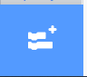

## Make a Scratch application to classify songs

Your model is trained and ready to test, but to do that you need to create a scratch project that can allow your user to input text and classify the input as heroic or villainous.

{:width="300px"}

### **Your project will:**
+ Take text input from the user
+ Use your trained ML model to classify text
+ Tell the user whether the input is 'good' or 'evil'

--- task ---

On your [**project page**](https://machinelearningforkids.co.uk/#!/projects){:target="_blank"}, select **Make**:

--- /task ---

--- task ---

On the next page, select Scratch 3

--- /task ---

A special fork of Scratch will open in a new tab. When it does, you will see an item in the left-hand menu with the same name as your machine learning project.

The new grey blocks you can see in that menu allow you to access your machine learning model from within your project:

{:width="100px"}

### Add the text extension
--- task ---

Select the blue Extensions button at the bottom left of your screen.

--- /task ---

--- task ---

Scroll down the page and select the `Spotify`{:class="block3flag"} extension.

You will see it add several new green blocks, allowing you access to Spotify’s music and database.

--- /task ---

You’re now all set up and ready to code the app that will classify songs from the online music database in the next step!

--- collapse ---
---
title: Pro tip - Save your work!
---

This special version of Scratch allows you to access your machine learning model, as well as use the music database blocks - **if you try to open your project in another version of Scratch online it probably won’t work**. 

A hack you can use is to save your work to your computer often. Once you have the .sb3 file for your project saved you can open it again later, or on another computer:
+ Go to [rpf.io/mlscratch](rpf.io/mlscratch){:target="_blank"} to get to this special fork of Scratch 
+ Once Scratch opens choose File > Load from your Computer
+ Select your file in the window that appears to get back to where you left off

Save your work as often as you can to make sure you don’t lose any progress!

--- /collapse ---

