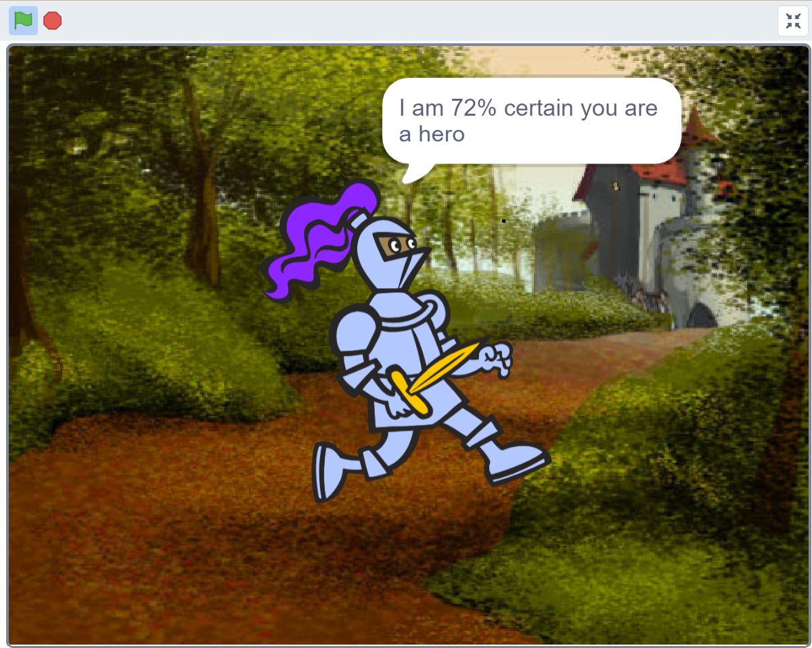
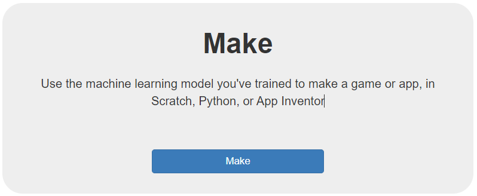
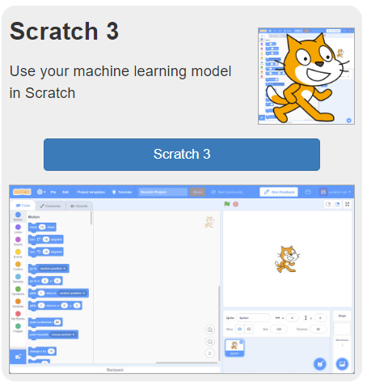
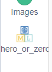
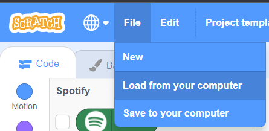

## Make a Scratch application to classify quotes

<div style="display: flex; flex-wrap: wrap">
<div style="flex-basis: 200px; flex-grow: 1; margin-right: 15px;">
Your model is trained and ready to test, but to do that you need to create a scratch project that can allow your user to input text and classify the input as heroic or villainous.
</div>
<div>
{:width="300px"}
</div>
</div>


### **Your project will:**
+ Take text input from the user
+ Use your trained ML model to classify text
+ Tell the user whether the input is from a 'hero' or 'villain'

--- task ---

On your [**project page**](https://machinelearningforkids.co.uk/#!/projects){:target="_blank"}, select **Make**:


--- /task ---

--- task ---

On the next page, select Scratch 3


--- /task ---

<div style="display: flex; flex-wrap: wrap">
<div style="flex-basis: 200px; flex-grow: 1; margin-right: 15px;">
A special fork of Scratch will open in a new tab. When it does, you will see an item in the left-hand menu with the same name as your machine learning project.

The new grey blocks you can see in that menu allow you to access your machine learning model from within your project:
</div>
<div>
{:width="100px"}
</div>
</div>

--- collapse ---
---
title: Pro tip - Save your work!
---

This special version of Scratch allows you to access your machine learning model, as well as use the music database blocks - **if you try to open your project in another version of Scratch online it won’t work**. 

A hack you can use is to save your work to your computer often. Once you have the .sb3 file for your project saved you can open it again later, or on another computer:
+ Go to [rpf.io/mlscratch](rpf.io/mlscratch){:target="_blank"} to get to this special fork of Scratch 
+ Once Scratch opens choose File > Load from your Computer
+ Select your file in the window that appears to get back to where you left off




Save your work as often as you can to make sure you don’t lose any progress!

--- /collapse ---

--- task ---

Add a `when green flag clicked`{:class="block3events"} block to your workspace. This is the script that will run the first time we start the project. 

```blocks3
when green flag clicked
```

--- /task ---

The next thing we want our application to do is ask the user to input some text - this is the text that will be compared by the model and classfied as `hero` or `villain`.

--- task ---

In the blue `Sensing`{:class="block3sensing"} menu, add an `ask (What's your name?) and wait`{:class="block3sensing"} block:

```blocks3
when green flag clicked
ask [What's your name?] and wait
```

--- /task ---

--- task ---

Change the question text to something you like. Ask your user to enter a quote. You could say something like:
+ What is your quote?
+ Halt! Who goes there?
+ Enter your favourite quote to start!
+ Type something to see if you are a hero or a villain!

```blocks3
when green flag clicked
ask [You there! What say you?] and wait
```

--- /task ---

--- task ---

From the purple `Looks`{:class="block3looks"} menu, add a `say (Hello!)`{:class="block3looks"} block to your script.

```blocks3
when green flag clicked
ask [You there! What say you?] and wait
say [Hello!]
```

--- /task ---

Now, we're going to create the message your application will show the user when it has classified the text they entered. To do that, we're going to `join`{:class="block3operators"} some bits of text (called strings) with data from your machine learning model using specific blocks. 

The example message will say: "I am `(model confidence: number)`% certain you are a `(model label: hero/villain)`!

--- task ---

From the green `Operators`{:class="block3operators"} menu, place a round `join (apple) (banana)`{:class="block3operators"} block into the hole in the purple `say`{:class="block3looks"} block:

```blocks3
when green flag clicked
ask [You there! What say you?] and wait
say ((join [apple] [banana]))
```

--- /task ---

--- task ---

Add another round `join (apple) (banana)`{:class="block3operators"} block into the hole in the one you just added (it doesn't matter which hole):

```blocks3
when green flag clicked
ask [You there! What say you?] and wait
say (join ((join [apple] [banana])) [banana])
```

--- /task ---

--- task ---

Add one last round `join (apple) (banana)`{:class="block3operators"} block into the hole in the one you just added (it doesn't matter which hole):

```blocks3
when green flag clicked
ask [You there! What say you?] and wait
say (join (join [apple] [banana]) ((join [apple] [banana])))
```
--- /task ---

--- task ---

Into the first hole that says `apple` type `I am ` 
Make sure you include a space at the end!

```blocks3
when green flag clicked
ask [You there! What say you?] and wait
say (join (join [I am ] [banana]) (join [apple] [banana]))
```
--- /task ---

--- task ---

Into the second hole that says `banana` drag a black `recognise text [text] (confidence)` block from the Machine learning for kids menu at the very bottom:

```blocks3
when green flag clicked
ask [You there! What say you?] and wait
say (join (join [I am ] (recognise text [text] confidence :: #4b4c60)) (join [apple] [banana]))
```
--- /task ---

--- task ---

Into the next (third) hole, that still says `apple` type `% sure you are a  ` 
Make sure you include a space at the end!

```blocks3
when green flag clicked
ask [You there! What say you?] and wait
say (join (join [I am ] (recognise text [text] confidence :: #4b4c60)) (join [% sure you are a  ] [banana]))
```
--- /task ---

--- task ---

Into the last (fourth) hole that still says `banana` drag a black `recognise text [text] (label)` block from the Machine learning for kids menu at the very bottom:

```blocks3
when green flag clicked
ask [You there! What say you?] and wait
say (join (join [I am ] (recognise text [text] confidence :: #4b4c60)) (join [% sure you are a  ] (recognise text [text] (label))))
```
--- /task ---
